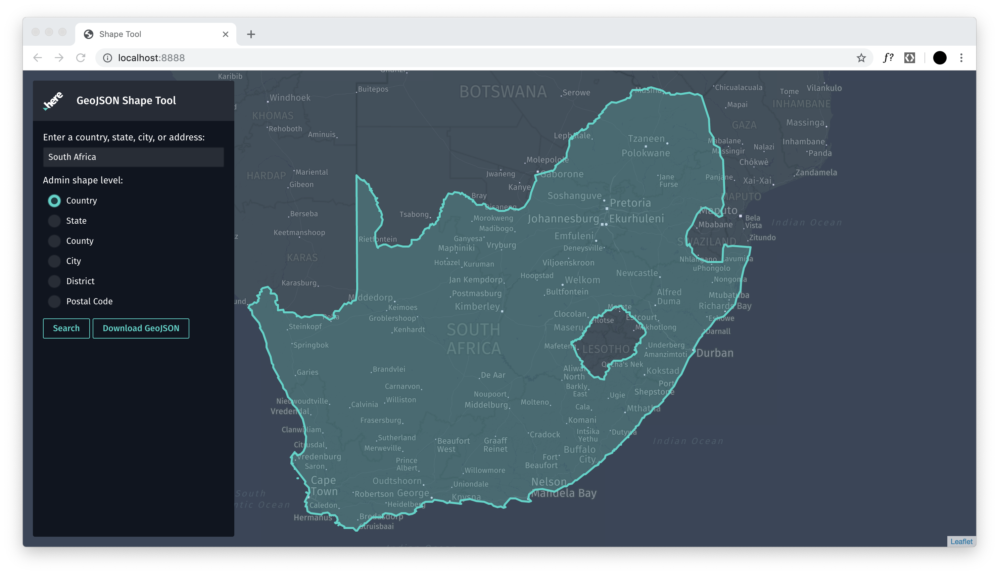

# GeoJSON Shape Tool

__[View live tool](https://dbabbs.github.io/geojson-shape-tool)__

This tool enables access to administration level polygon boundaries. You can access shapes from the following administration levels:
- country
- state
- county
- city
- district
- postal code

## Usage

1. Search for a administrative region, like `California`, `Singapore`, or `South Africa`
2. Select which administrative level you would like
3. The map will draw the administrative region on the map. If this is the region you would like, click `Download GeoJSON`
4. The tool will download a `FeatureCollection` of GeoJSON with 1 feature.

## Usage with XYZ

This tool is great for augmenting your XYZ maps with boundaries.

Head to [XYZ Studio](https://xyz.here.com/studio) to upload the GeoJSON and add to your maps

## How this was made
- [HERE Map Tile API](https://developer.here.com/documentation/map-tile/topics/quick-start-map-tile.html) for the map tiles
- [Leaflet](https://leafletjs.com/) for the map display and control
- [HERE Geocoding API](https://developer.here.com/api-explorer/rest/geocoder/reverse-geocode-postal-shape) for access to the shapes
- [ESRI Terraformer](https://github.com/Esri/terraformer) for converting from WKT to GeoJSON

## Issues, Comments, or Questions

Please file an issue in this repository and add @dbabbs as a watcher. Happy mapping!
